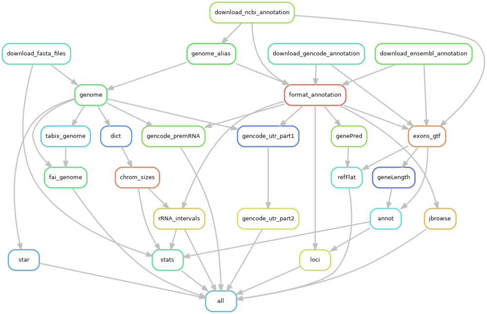

# refsnake - Build Reference Genomes and Annotations 
[](https://www.gnu.org/licenses/gpl-3.0)

This Snakemake workflow generates reference genomes and annotation files for various organisms, including human, mouse, rat, cynomolgus monkey, pig, and rabbit, by retrieving data from RefSeq/NCBI, Ensembl, and Gencode. The resulting files are specifically designed for RNASeq data analysis, such as bulk RNASeq (see [bksnake](https://github.com/bedapub/bksnake)).


# Table of Contents
- [Description](#description)
- [Workflow overview](#overview)
- [Requirements](#requirements)
- [Installation and Usage](#usage)
- [Configuration](#configuration)
- [Usage](#usage)
- [Output](#output)
- [Misc](#misc)
- [To Do's](#todos)
- [Contributing](#contributing)
- [License](#license)

  
## Description ([top](#top)) <a name="description"></a>

In this project, we download fasta, gtf, and gff3 files from reputable sources such as [NCBI](https://ftp.ncbi.nlm.nih.gov/),  [Ensembl](https://ftp.ensembl.org/pub/) and [Gencode](https://ftp.ebi.ac.uk/pub/databases/gencode/) FTP websites. These files undergo several processing steps, including filtering and re-formatting of gtf and gff3 files, as well as renaming chromosomes and contigs. Additionally, we generate additional files that are useful for RNASeq data analysis, such as [STAR](https://github.com/alexdobin/STAR) aligner indices, sequence dictionaries using [Picard](http://broadinstitute.github.io/picard/), gene lengths using [gtftools](http://www.genemine.org/gtftools.php), and genePred files using [gtfToGenePred](https://github.com/ENCODE-DCC/kentUtils/tree/master/src/hg/utils/gtfToGenePred). To facilitate these tasks, we utilize tools such as [BEDTools](https://bedtools.readthedocs.io/en/latest/), [Tabix](http://www.htslib.org/doc/tabix.html) and [SAMTools](http://www.htslib.org/doc/)


## Workflow overview ([top](#top)) <a name="overview"></a>




## Requirements ([top](#top)) <a name="requirements"></a>

This workflow requires the following tools in the system path

1. [Singularity](https://docs.sylabs.io/guides/main/user-guide/)
2. [Snakemake](https://snakemake.readthedocs.io/en/stable/)
3. [git](https://en.wikipedia.org/wiki/Git)

In order to pull Singularity images from GitHub package registry one needs to specify username and GitHub read package token:

```bash
export SINGULARITY_DOCKER_USERNAME=<username>
export SINGULARITY_DOCKER_PASSWORD=<github read package token>
```


## Installation and Usage ([top](#top)) <a name="usage"></a>

First, clone the repository and edit the parameters in the configuration, `config.yaml`, file as necessary (see section below).
Then, run Snakemake locally or submit the workflow to the cluster queue (see [Snakemake documentation](https://snakemake.readthedocs.io/en/stable/executing/cluster.html))

```bash
# clone repo
git clone https://github.com/bedapub/refsnake.git \
  && cd refsnake
  
# edit the config
cat config/config.yaml

# set token for Singularity image
export SINGULARITY_DOCKER_USERNAME=<user>
export SINGULARITY_DOCKER_PASSWORD=<token>

# local execution
snakemake --snakefile workflow/Snakefile --configfile config/config.yaml \
    --use-singularity --singularity-args "--contain --cleanenv" \
    --latency-wait 10 --cores 8 \

# cluster submission
PROFILE=<path to cluster profile>

snakemake --snakefile workflow/Snakefile --configfile config/config.yaml \
    --use-singularity --singularity-args "--contain --cleanenv" \
    --report 
    
```

Ensure to use the Singularity feature. A token for GitHub read package is required for pulling Singularity images.

Another example to process only one genome, e.g. 'hg38'. The config parameter is specified directly via the command line

```bash
export SINGULARITY_DOCKER_USERNAME=<user>
export SINGULARITY_DOCKER_PASSWORD=<token>

PROFILE=<path to cluster profile>

snakemake --snakefile workflow/Snakefile --configfile config/config.yaml \
    --use-singularity --singularity-args "--contain --cleanenv"   \
    --latency-wait 10 --jobs 100 --profile ${PROFILE} \
    --config outdir=genomes ids="['hg38']" 
```

After successful completion of the workflow, create Snakmake html report

```bash
snakemake --snakefile workflow/Snakefile --configfile config/config.yaml --report
```

## Configuration ([top](#top)) <a name="configuration"></a>

Parameters to specify:
- `ids`: species id or labels to be processed, must match the `genomes` dictionary
- `outdir`: path to the output directory

```
ids: ['hg38', 'chm13', 'mm39', 'mm10', 'mfa5', 'MFA1912RKSv2', 'rn6', 'rn7', 'ss11', 'oc2', 'Vero_WHO_p1.0']

outdir: 'output'
```

Optional parameters that can be adjusted are `star version` and `star image` (Singularity) as well as `star_threads` and `star_mem_mb`, threads and memory for STAR indices generation.


## Output ([top](#top)) <a name="output"></a>

Output files comprise genomes and gene annotations files. 
For example, all output files for human "hg38" listed below.
Note that for certain species, not all annotations are available and therefore, the corresponding files are of size zero.

```
outdir/hg38/
├── 3utr
│   └── gencode
│       ├── gencode.3utr.annotation.txt
│       ├── gencode.3utr.bed
│       └── gencode.3utr.fa
├── ensembl.alias
├── fasta
│   ├── genome.chrom.sizes
│   ├── genome.dict
│   ├── genome.fa
│   ├── genome.fa.fai
│   ├── genome.fa.gz
│   ├── genome.fa.gz.fai
│   ├── genome.fa.gz.gzi
│   ├── genome.rRNA_intervals
│   └── genome.version
├── gencode.alias
├── gff3
│   ├── ensembl
│   │   ├── ensembl.gff3
│   │   ├── ensembl.gff3.gz
│   │   └── ensembl.gff3.version
│   ├── gencode
│   │   ├── gencode.genes.bed
│   │   ├── gencode.gff3
│   │   ├── gencode.gff3.gz
│   │   └── gencode.gff3.version
│   └── refseq
│       ├── refseq.gff3
│       ├── refseq.gff3.gz
│       └── refseq.gff3.version
├── gtf
│   ├── ensembl
│   │   ├── ensembl.discarded.gtf
│   │   ├── ensembl.discarded-exons.gtf
│   │   ├── ensembl.exons.annot
│   │   ├── ensembl.exons.annot.gz
│   │   ├── ensembl.exons.geneLength
│   │   ├── ensembl.exons.geneLength.gz
│   │   ├── ensembl.exons.gtf
│   │   ├── ensembl.exons.gtf.gz
│   │   ├── ensembl.genePred
│   │   ├── ensembl.gtf
│   │   ├── ensembl.gtf.gz
│   │   ├── ensembl.gtf.version
│   │   ├── ensembl.loci.txt
│   │   ├── ensembl.refFlat
│   │   ├── ensembl.sorted.gtf.gz
│   │   └── ensembl.sorted.gtf.gz.tbi
│   ├── gencode
│   │   ├── gencode.discarded.gtf
│   │   ├── gencode.discarded-exons.gtf
│   │   ├── gencode.exons.annot
│   │   ├── gencode.exons.annot.gz
│   │   ├── gencode.exons.geneLength
│   │   ├── gencode.exons.geneLength.gz
│   │   ├── gencode.exons.gtf
│   │   ├── gencode.exons.gtf.gz
│   │   ├── gencode.genePred
│   │   ├── gencode.gtf
│   │   ├── gencode.gtf.gz
│   │   ├── gencode.gtf.version
│   │   ├── gencode.loci.txt
│   │   ├── gencode.refFlat
│   │   ├── gencode.sorted.gtf.gz
│   │   └── gencode.sorted.gtf.gz.tbi
│   └── refseq
│       ├── refseq.discarded.gtf
│       ├── refseq.discarded-exons.gtf
│       ├── refseq.exons.annot
│       ├── refseq.exons.annot.gz
│       ├── refseq.exons.geneLength
│       ├── refseq.exons.geneLength.gz
│       ├── refseq.exons.gtf
│       ├── refseq.exons.gtf.gz
│       ├── refseq.genePred
│       ├── refseq.gtf
│       ├── refseq.gtf.gz
│       ├── refseq.gtf.version
│       ├── refseq.loci.txt
│       ├── refseq.refFlat
│       ├── refseq.sorted.gtf.gz
│       └── refseq.sorted.gtf.gz.tbi
├── premRNA
│   └── gencode
│       └── gencode.premRNA.fasta
├── refseq.alias
└── star_2.7.10b
    ├── chrLength.txt
    ├── chrNameLength.txt
    ├── chrName.txt
    ├── chrStart.txt
    ├── Genome
    ├── genomeParameters.txt
    ├── Log.out
    ├── SA
    └── SAindex
```


## Misc ([top](#top)) <a name="misc"></a>

How to create the rulegraph file and adjust the graphic size

```bash
unset SINGULARITY_DOCKER_USERNAME
unset SINGULARITY_DOCKER_PASSWORD

snakemake --rulegraph all | dot -Tpng > rulegraph.png

singularity run docker://dpokidov/imagemagick:latest rulegraph.png -resize 1000x800 resized-rulegraph.png
```


## To Do's ([top](#top)) <a name="todos"></a>

- Remove different handling of chm13 and MFA1912RKSv2 genomes
- Better handling of genomes without annotations (e.g. gencode), avoid creating "empty" files
- Download of genome fasta files from Ensembl or NCBI, keep both or restrict to one?
- STAR singularity image function
- Avoid splitting/merging of genome fasta files
- Replace Perl code with Python (rRNA intervals)
- Improve sorting of chromosomes and contigs
- Merge rules "gencode_utr_part1" and "gencode_utr_part2"
- Consider more "local rules"


## Contributing ([top](#top)) <a name="contributing"></a>

Any contribution, feedback and bug report highly welcome. For major changes, please open an issue first to discuss what you would like to change. Thank you!


## License ([top](#top)) <a name="license"></a>

[GNU GPLv3](https://choosealicense.com/licenses/gpl-3.0/)

([To the top of the page](#top))
